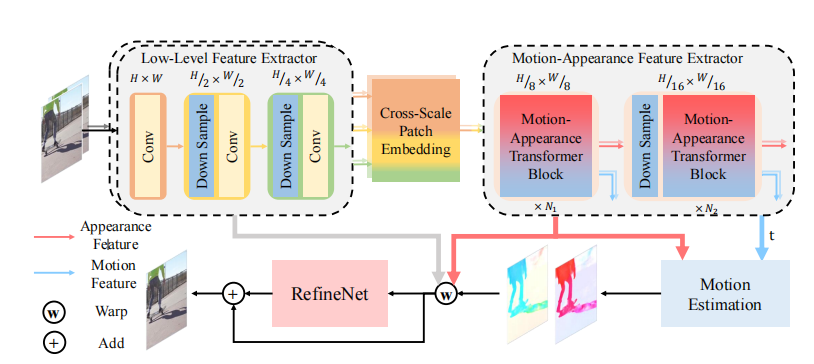
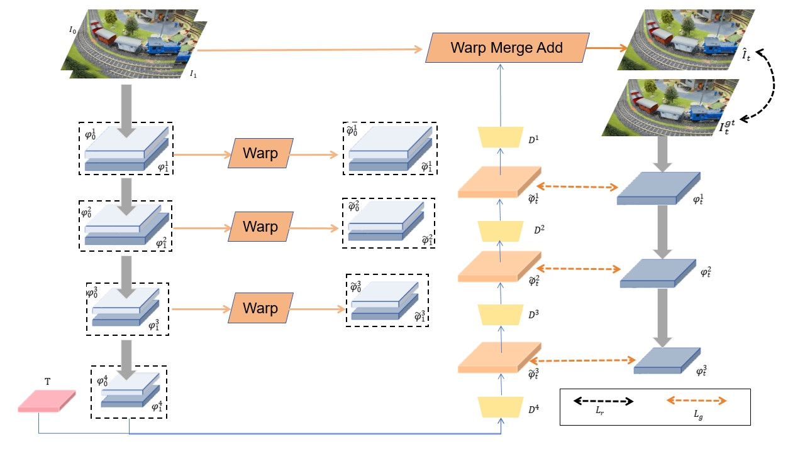
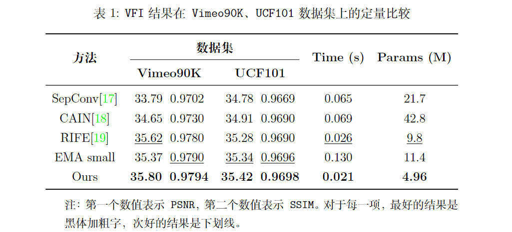

- 原论文框架：

<div align='center'>
    
</div>

- 基于老师给出的意见做出的修改后框架：

<div align='center'>
    
</div>

- 改进后效果：

  <p float="left">
      
      
  </p>

- 与其他论文提出的模型架构性能对比：

<div align='center'>
    
</div>

## Test

- 要测试运行时间和模型参数量，执行以下代码

```
$ python benchmarks/speed_parameters.py
```

- 要测试在 `Vimeo90K` 和 `UCF101` 数据集上的帧插值精度，执行以下代码

```
$ python benchmarks/Vimeo90K.py
$ python benchmarks/UCF101.py
```

> 其中，需要提醒的是，数据集文件这里没有提供，需要下载后放到 `dataset` 路径下后才能测试精度。另外，你需要确保 `imageio==2.25.1` ，否则可能会出现图像维度不匹配，无法将插帧结果进行可视化。

## Demo

分别提供了叠加了2x、8x和Nx的视频插帧

```
$ python demo_2x.py
$ python demo_8x.py
$ python demo_Nx.py
```

> 其中，需要提醒的是 `demo_2x` 至少需要4GB的内存、`demo_8x` 至少需要13GB内存，而 `demo_Nx` 需要的内存取决于具体插入的帧数，可自行修改。同样，这里依旧需要确保 `imageio==2.25.1` 。